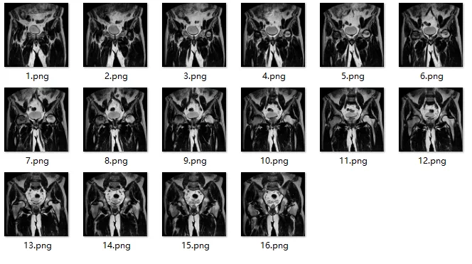
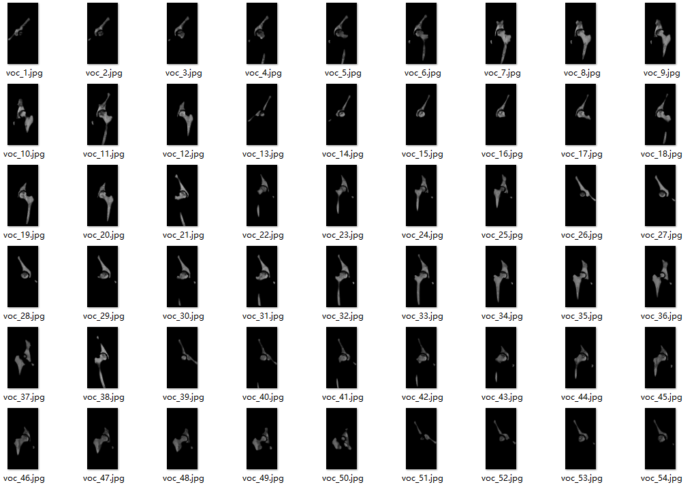
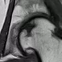
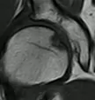
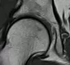

## Body

The MRI image dataset of the osteonecrosis of the femoral head (ONFH) disease

This is an MRI image dataset of the osteonecrosis of the femoral head (ONFH) disease. To remove patient information, it is in PNG format.

Original_dataset means: This is the result of converting the original double-communication data. Each folder represents the multi-slice MRI images of a patient or healthy individual.

seg_dataset means: This is the image obtained by splitting each layer into left and right images. The image only contains key information such as the femur and hip socket.

## Images

Here is a pay link on Stripe ( https://buy.stripe.com/3cs8yP7sY87d0vu9AB ). Please contact me lonlonago@foxmail.com after funding $89, and I will send you a complete data files , thank you!

